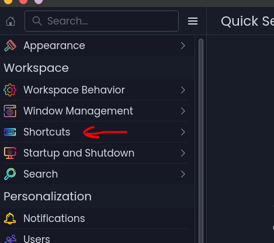
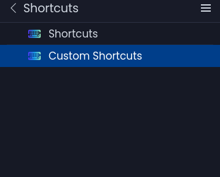
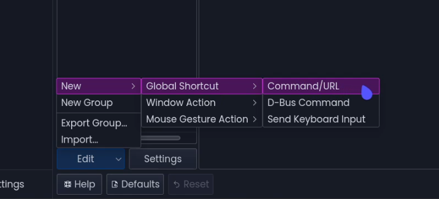
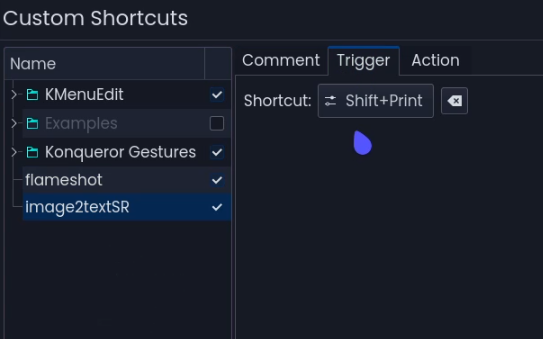
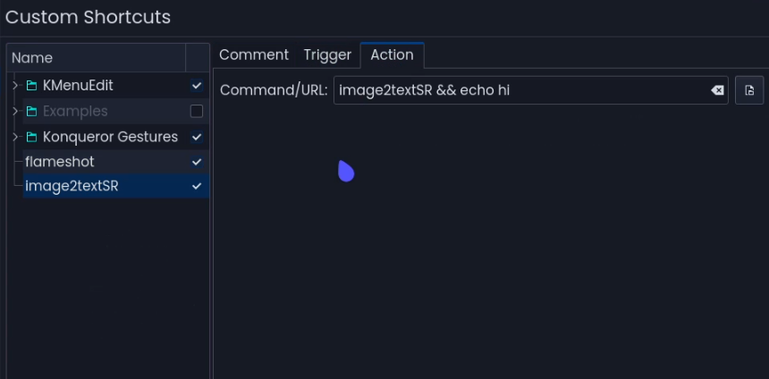
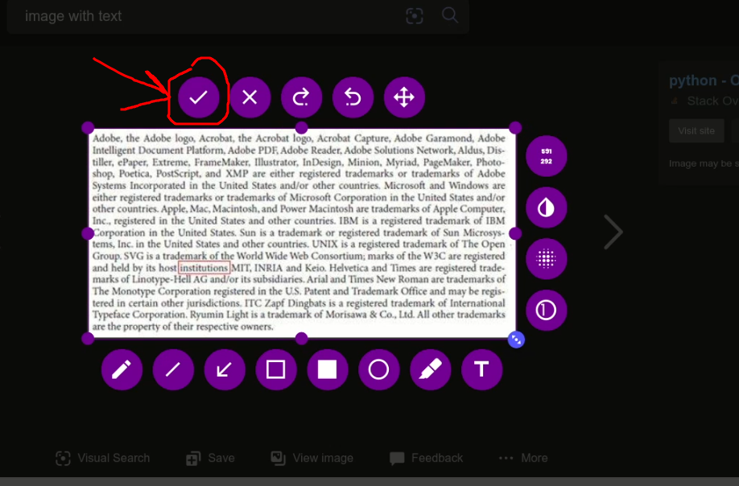

# requirements
```
xclip
```

# image2textSR

Copy text from image using screenshot tool in debian based(ubuntu)/arch based(manjaro) linux distro...

Make sure you have python3...

```
git clone https://github.com/SR-Hossain/image2textSR
cd image2textSR
sudo sh install.sh
```

After that run this command

```bash
image2textSR
```

on terminal and voila, see the magic!!!

- ## Use cursor to select area to copy
- ## then click on the tick mark to confirm the selection...

Tips: I would recommend that make a custom shortcut in your distro for terminal command... when giving command in custom shortcut give this command to work properly:

```
image2textSR && echo hiii
```

> # Go To Settings


> # Go To Custom Shortcut Settings. Below is an example from KDE. 


> # Add a new custom shortcut


> # Add your keyboard shortcut


> # Add your command line in action


> # Then use your shortcut and press on the tick button



<h1>I have used flameshot as screenshot tool here... Take a tour in <a href="https://github.com/flameshot-org/flameshot">the github page</a> of flameshot.....</h1>
